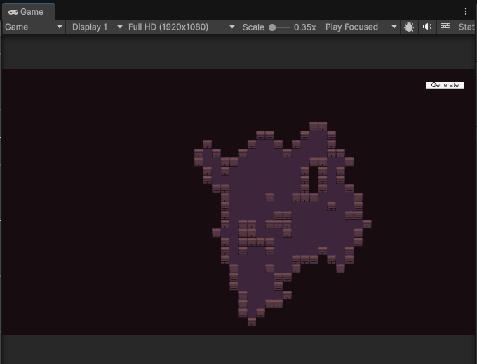
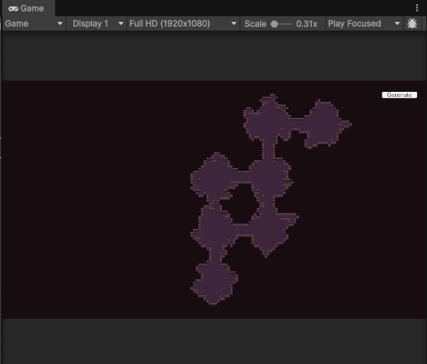

# 2D 던전 절차적 생성 (Unity)

이 프로젝트는 Unity 엔진을 사용하여 2D 던전을 절차적으로 생성하는 시스템입니다.

## 주요 기능

-   **던전 생성 알고리즘:**
    -   **단순 무작위 보행 (Simple Random Walk):** 무작위 보행을 통해 바닥 타일을 생성하는 기본적인 던전 생성 방식입니다.
    -   **복도 우선 생성 (Corridor First Generation):** 복도를 먼저 생성한 다음, 이 복도를 기반으로 방을 배치하는 방식으로 던전을 생성합니다.
-   **타일맵 시각화:** 생성된 던전 구조를 Unity의 타일맵 시스템을 통해 시각적으로 표현합니다.
-   **벽 생성:** 생성된 바닥 영역을 기반으로 주변에 자동으로 벽을 생성합니다.

